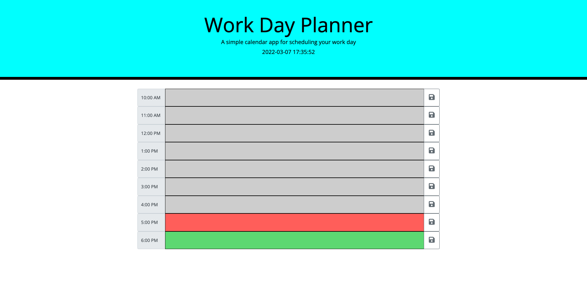

# Work Day Planner

https://github.com/Akaiafas526/Work-Planner

https://akaiafas526.github.io/Work-Planner/

## Description:

If you are unorganized and looking for a quick easy way to schedule out your day, then you have come to the right page! Welcome to the Work Day Planner, an interactive daily planner where you can type in daily tasks through the hours of 10:00 AM until 6:00 pm (1100 - 1800 Military Time). This planner allows you to save any task written in the text boxes for the whole day, the current hour will display red, past hour will appear green and future hours are colored grey. It truly is a simple web planner but very useful and easy to use! Page will always be updated to the recent day and time which will be displayed in the header.

